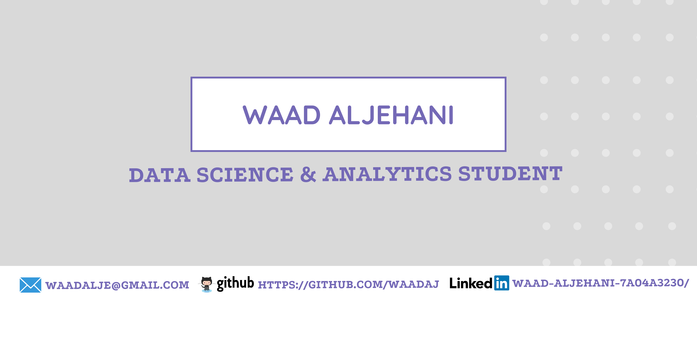

<!-- <h2 align='center'>Waad Aljehani</h2>

<b>Data Science and Analysis Student at University of Jeddah</b>
 -->

<h2>Hello World! <3 </h2>

My name is Waad Aljehani, I'm a data science student, I'm very passionate about machine learning and data mining :) 
- <i>Currently:</i>  Data Science Student at University of Jeddah. 

<h2>💻 I'm Currently Learning</h2>

__University of Jeddah__
- CCCN 412 Cloud Computing
- CCDS 222 Database II
- CCDS 322 Applied Machine Learning

<h2>Currently working:</h2>
<h4>Machine learning projects using python</h4>

__Check out my GitHub repository:__

  

    
    
  

<h2> About Me:</h2>

I'm a Data Science & Analysis Student at University of Jeddah ..
- Know more about me: [About Waad]()
- Write to me: [waadalje@gmail.com](mailto:waadalje@gmail.com)

<h2>📫 Find me around the web:</h2>

